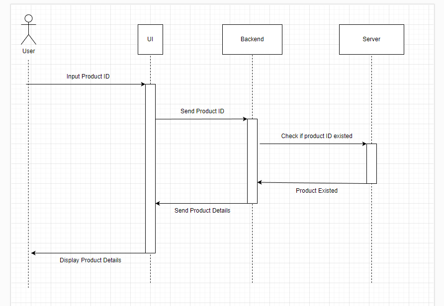
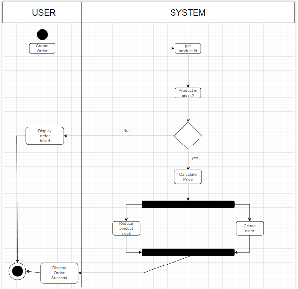

# E-commerce Design

## Given product id, show the product details



Untuk graph di atas, saya menggunakan sequence diagram untuk memvisualkan ketika user memanggil/search product id dan apa yang terjadi di belakang ui back end & server.

## Create order



Untuk graph di atas, adalah proses pembuatan order, pembayaran, dan pengurangan stock.

## Pseudocode

```
calculatePrice() {
  let totalPrice = 0
  for each product in cart:
    totalPrice = totalPrice + (product * price)
    products.stock -= 1

  return totalPrice
}
```

Complexity Analysis: O(n)

akan terjadi pengulangan untuk penghitungan harga terhadap produk dan kuantitas.
